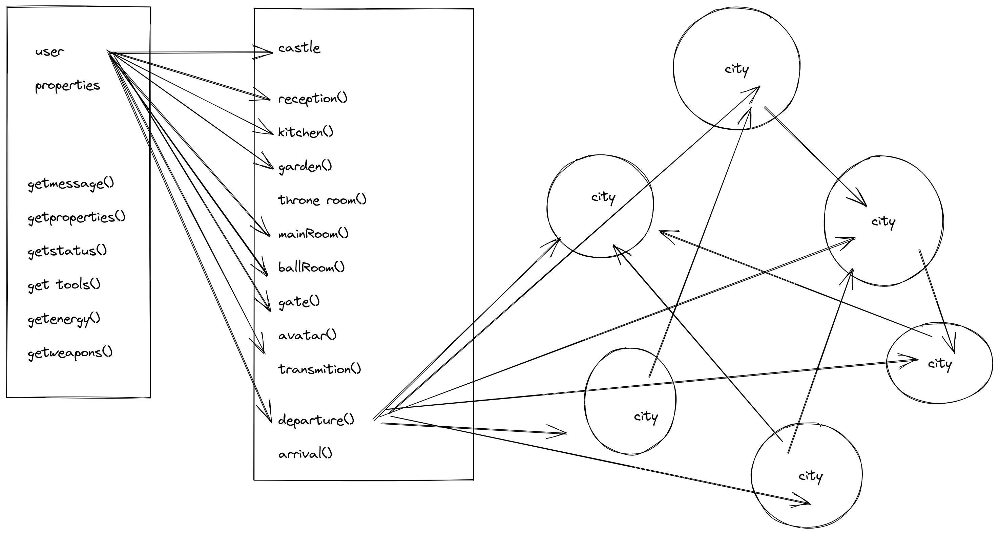
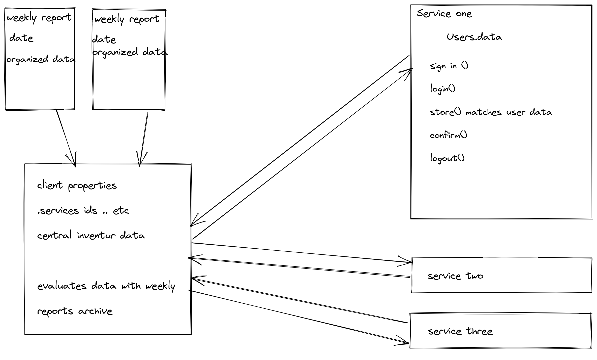

# Projects to further develop
## . game dev - USER or Castle
## . Inventur APP
  
# * USER or CASTLE 
### *title still in process
## game developer project 

user or Castle is a project that I started to develop as the final project of programing fundamentals from my previous class. My first idea was to develop a story telling game: a book that has a dramaturgy that the reader interacts with. This project was developed until the end of the castle. Cities have not been developed neither Inter-activities like challenges with other characters, or users. My wish is one day to translate this project to DOM language and to further develop into the game world. 

If you want to see more about this project:

[Ivo Serra github repository](https://github.com/ivoserra/javaProject).

## the story
User or Castle is a story game where the consumer takes decisions through multiple choices developing different outcomes or dramaturgies. The goal of this game is that the user is able to return to the castle and can sum up all what he could gather from is adventures. If the sum is higher then expected the user will have access to the throne room and claim as hero within a multitude of heros of the Castle.

 

## Castle 

  
The Castle is a secret place where all users arrive before they are assigned their avatar identities so they can proceed into their journeys and missions. 
In the castle the user has to go through several rooms, each room has conditions to which the user has go through so he can earn and gather properties, values, energy, etc... that will help on its mission. when the user gets all the necessary attributes, he then creates an avatar and assigns it to a mission to which e needs to go too.  
  

## Cities

  
Cities are locations on a Multi-diverse universe.
To be able to arrive to each city the user must have an avatar and hide is true-identity. The castle  should never be revealed to no one.
Cities are challenging places, for example, users can challenge other users for whatever challenge might be designed by its location within the city. In every location the User can get more properties and points but he can also loose them even being deported from the city or erased from the story.

  
## the code-story
For this project I have developed 2 classes , one of the classes needs to assign into the other class methods.
In every every assignment there is a automatic message on the node Terminal , where one can read the story and directions. 
By passing each condition the class designed as space inserts data properties with values in the user. 

## Initial game structure 

  

### Images used for this project are from the artist woodkid to which I have as a bigger reference, not only for its visual but for his music and art.

---------------------------------------------------------------------------------------------------------------------------

***
  
# Inventure APP

### Inventure is an APP that wants to gather and track data of a weekly reports: Evaluates it and makes requests to 'buy' what is missing to other services. 

first list topics: 

a) weekly object with data of the inventure.

b) A Manager that manages data of every record, and evaluates the difference of each week to its main data. keeps record.

c) A service object or three,  where the manager have access too. The manager must in this services bring his personal data and buy the difference or what can be possible at the designed service. The final outcome: the manager gathers data what bought in each service.

c.a) Within the service object exist conditions. example : verify if the user is a client of the service. How can a user sign in to the service. what type of services of the Service can the user have access too? how can that be created as record for both user and service?

First structural - map

James quote 'A personal project makes your world a better place'

---

Edit this **README.md** file. Write an outline of a project that you would be proud to work on. 

Use the **Wiki** (see the Wiki link in the navigation bar above) to create detailed specifications.

You don't have to think yet about _how_ to achieve the goals that you describe. You can simple focus on _what_ your goals are.

As you continue through the DCI course, think about how each new concept could help you achieve one or more of your goals.

Create different **branches** to experiment with ideas. Use each branch for a little "barebones" project that explores ways to provide a feature or a layout or a concept.

Change the **name of the repository** so that it reflects your purpose.

**Share the link** with your friends, your family, your fellow students. Talk about your ideas, your hopes, your successes.

Enjoy taking on a challenge that seems too big in the beginning, and gradually becomes realistic as your skills improve : )
